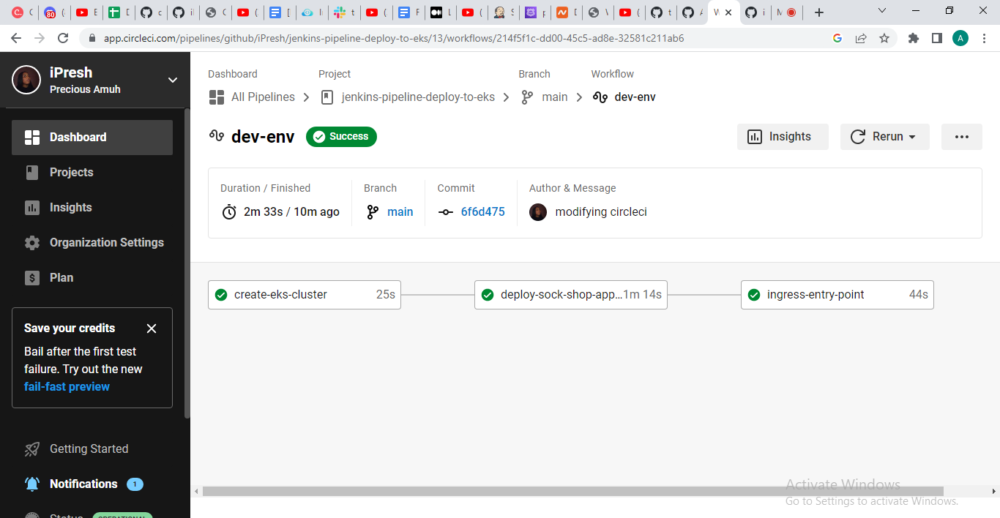
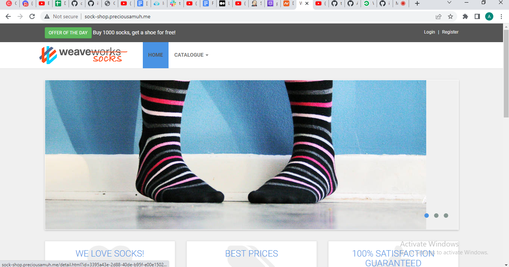
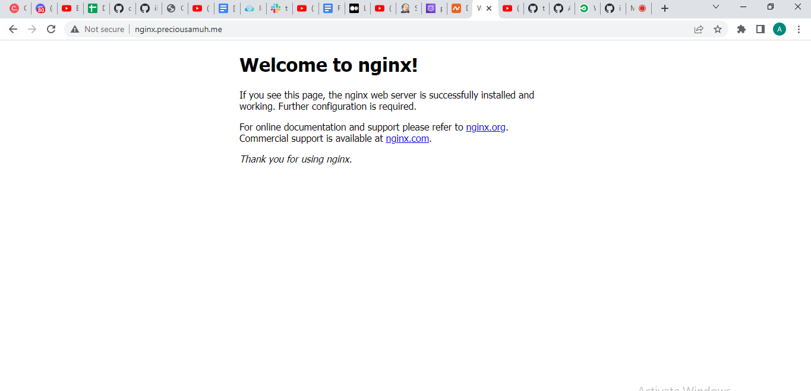
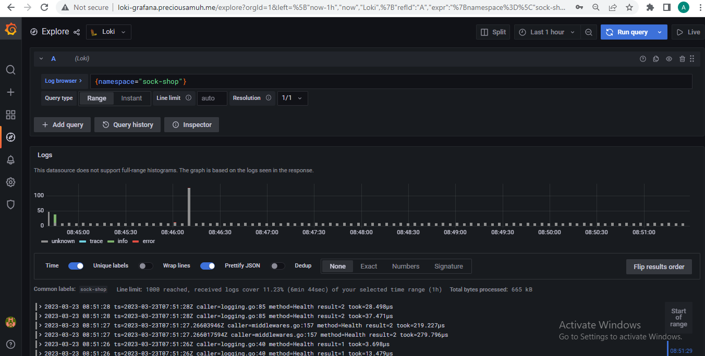
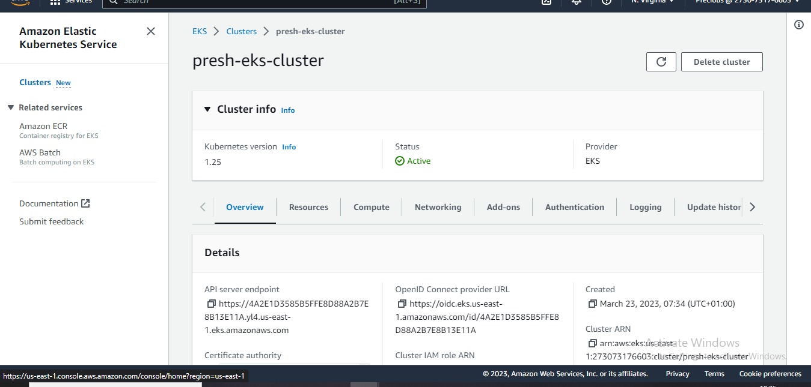
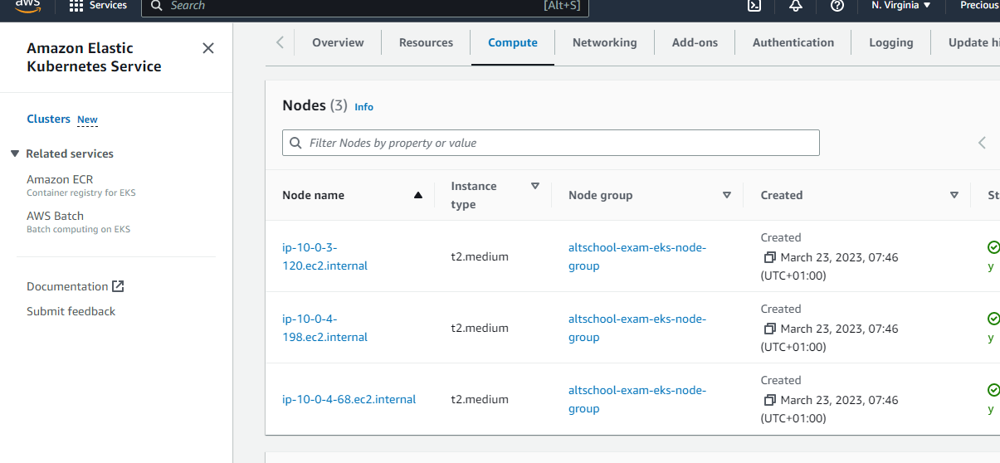
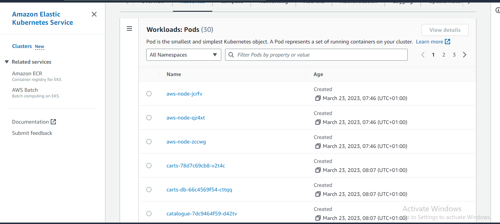
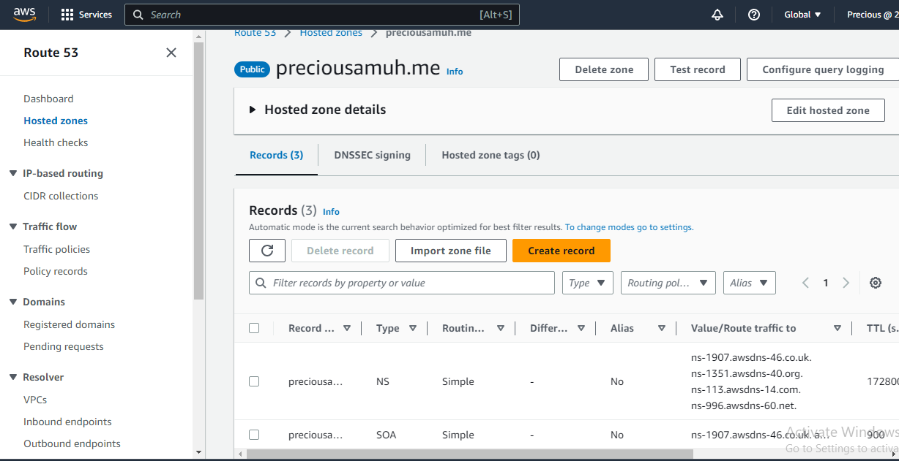

#### P.S: This repo is named "jenkins-pipeline.." because I did the task first with jenkins before using circle-ci

# The following are my URL links:
## sock-shop app url: 

    sock-shop.preciousamuh.me

## nginx app url:

    nginx.preciousamuh.me

## Loki-grafana url:

    loki-grafana.preciousamuh.me

### My log-in details:
username: admin  
password: 4vybTLFpkpDazMaZPv6ae8iqIEYrZmNhdiHjvOks

    
### Here is an image showing my CI/CD pipleline deployment to Amazon EKS using circle-ci

### My sock-shop application after deployment

### My nginx webserver after deployment

### My loki-grafana

### Proof of work

My cluster:  
  

My nodes:  
  

My pods:  
  

Route53 hosted zone:
  
